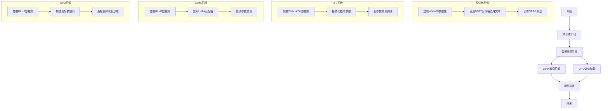

---

# 从零开始训练自己的CLM(Causal Language Model)

本项目提供了一整套基于 GPT-2 架构的因果语言模型（CLM）训练源代码，涵盖了四个主要阶段：
- **预训练**：从头开始大规模语料的无监督学习；
- **监督微调（SFT）训练**：在特定任务数据上进行有监督的微调；
- **直接偏好优化（DPO）训练**：利用用户偏好信息对模型进行优化；
- **LoRA 训练**：采用低秩适配（LoRA）技术，利用极少量参数对模型进行高效微调。

通过 GPT-2 模型训练这一具体案例，构建和训练出属于自己的因果语言模型。

## 训练流程



https://huggingface.co/openai-community/gpt2

## 目录结构

以下为项目的一个典型目录结构示例：

```
├── data                # 数据预处理及存储目录
├── model               # 模型权重保存与加载目录
├── train               # 训练、调试以及辅助脚本
│   ├── pretrain.py     # 预训练脚本
│   ├── sft.py          # 监督微调训练脚本
│   ├── dpo.py          # DPO 训练脚本
│   └── lora.py         # LoRA 训练脚本
├── config              # 各训练阶段的配置文件
├── requirements.txt    # Python 依赖包列表
└── README.md           # 项目说明文档
```

## 关键代码示例

### 1. 预训练 (pretrain.py)

```python
# 创建分词器
def create_tokenizer(config):
    tokenizer = BertTokenizerFast.from_pretrained(config["tokenizer_name"])
    tokenizer.bos_token = tokenizer.cls_token
    tokenizer.eos_token = tokenizer.sep_token
    if tokenizer.pad_token is None:
        tokenizer.pad_token = tokenizer.eos_token
    return tokenizer

# 创建模型
def create_model(tokenizer, config):
    model_name = config["model_name"]
    device = torch.device("cuda" if torch.cuda.is_available() else "cpu")
    model_config = GPT2Config.from_pretrained(
        model_name,
        vocab_size=tokenizer.vocab_size,
        n_positions=config["max_len"],
        n_ctx=config["max_len"],
        bos_token_id=tokenizer.bos_token_id,
        eos_token_id=tokenizer.eos_token_id
    )
    model = GPT2LMHeadModel(model_config)
    model.resize_token_embeddings(len(tokenizer))
    model.to(device)
    return model
```

### 2. 监督微调 (sft.py)

```python
# 格式化提示词
def formatting_prompt(sample):
    instruction = sample["INSTRUCTION"]
    input_text = sample.get("INPUT", "")
    response = sample["RESPONSE"]
    prompt = f"### Instruction:\n{instruction}\n### Input:\n{input_text}\n### Response:\n{response}\n"
    return prompt

# 使用TRL的SFTTrainer进行训练
trainer = SFTTrainer(
    model=model,
    args=training_args,
    data_collator=data_collator,
    train_dataset=dataset["train"],
    eval_dataset=dataset["test"],
    formatting_func=formatting_prompt,
)
```

- **DPO 训练模块**  
  采用直接偏好优化的方法，将用户或专家偏好融入模型训练流程，从而进一步提升模型响应的质量与人性化。

### 3. LoRA 训练 (lora.py)

```python
# 配置LoRA适配器
def create_model(config):
    model = AutoModelForCausalLM.from_pretrained(config["model_path"])
    lora_config = LoraConfig(
        task_type=TaskType.CAUSAL_LM,
        inference_mode=False,
        r=8,
        lora_alpha=32,
        lora_dropout=0.1,
        target_modules=["lm_head"]
    )
    model.add_adapter(lora_config, "clm_lora")
    return model

# 使用PEFT进行低秩适配训练
```

### 4. DPO 训练 (dpo.py)

```python
# 格式化偏好数据
def formatting(sample):
    prompt = f"### Instruction:\n{sample['prompt']}### Input:\n\n### Response:\n"
    chosen = f"{sample['chosen']}\n"
    rejected = f"{sample['rejected']}\n"
    return {"prompt": prompt, "chosen": chosen, "rejected": rejected}

# 使用TRL的DPOTrainer进行训练
trainer = DPOTrainer(
    model=model,
    ref_model=ref_model,
    args=training_args,
    train_dataset=dataset["train"],
    eval_dataset=dataset["test"],
    processing_class=tokenizer
)
```

## 配置文件示例

### 预训练配置 (config/pretrain.json)
```json
{
  "max_len": 512,
  "model_name": "gpt2",
  "tokenizer_name": "bert-base-chinese",
  "model_path":"./models"
}
```

### SFT配置 (config/sft.json)
```json
{
  "model_path":"./model/p-llm-createprivatellm-2",
  "output_dir": "./model/p-llm-createprivatellm-2-instruct"
}
```

### LoRA配置 (config/lora.json)
```json
{
  "max_len": 512,
  "model_path":"./model/p-llm-createprivatellm-2-chat",
  "output_dir": "./model/p-llm-createprivatellm-2-chat-lora"
}
```

### DPO配置 (config/dpo.json)
```json
{
  "model_path":"./model/p-llm-createprivatellm-2-instruct",
  "output_dir": "./model/p-llm-createprivatellm-2-chat"
}
```

## 环境要求与依赖

- **Python 版本**：Python 3.9+
- **依赖库**：项目所需的第三方库已列在 `requirements.txt` 中。建议使用如下命令安装：
  ```bash
  pip install -r requirements.txt
  ```
- **硬件要求**：推荐使用支持 CUDA 的 GPU 来加速训练过程（也可在 CPU 上运行，但速度较慢）。

    RTX 4060 Ti 16G X 1

## 使用说明

1. **克隆项目仓库**  
   在终端中执行以下命令克隆仓库并进入项目目录：
   ```bash
   git clone https://github.com/gammachen/p-llm-createprivatellm-2.git
   cd p-llm-createprivatellm-2
   ```

2. **安装依赖**  
   执行以下命令安装所有所需依赖：
   ```bash
   pip install -r requirements.txt
   ```

3. **数据准备**  
   将预训练和微调所需的数据放入 `data` 目录中，并根据需要调整 `config` 中的配置文件参数。

4. **运行训练脚本**  
   根据需要选择不同的训练阶段：
   - **预训练**  
     ```bash
     python train/pretrain.py --config config/pretrain.json
     ```
   - **监督微调（SFT）训练**  
     ```bash
     python train/sft.py --config config/sft.json
     ```
   - **DPO 训练**  
     ```bash
     python train/dpo.py --config config/dpo.json
     ```
   - **LoRA 训练**  
     ```bash
     python train/lora.py --config config/lora.json
     ```
   脚本中的命令行参数和配置项可根据具体实验要求进行调整。

5. **调试与测试**  
   项目支持在本地运行时进行断点调试和参数验证，方便用户通过逐步执行来观察模型训练的中间效果与指标。

6. **训练成果**

- [预训练](https://huggingface.co/gammacheno/p-llm-createprivatellm-2)

- [SFT](https://huggingface.co/gammacheno/p-llm-createprivatellm-2-Instruct)

- [DPO](https://huggingface.co/gammacheno/p-llm-createprivatellm-2-Chat)
 
- [LoRA](https://huggingface.co/gammacheno/p-llm-createprivatellm-2-Chat-LoRA)

## 参数配置

- 每个训练阶段均提供详细的参数配置，请先确认 `config` 目录下对应配置文件中的参数设置是否符合当前实验环境要求。
- 为获得最佳训练效果，可依据数据规模、模型复杂度及训练资源灵活调整批次大小、学习率等参数。

## 贡献

欢迎对此项目提出改进建议、反馈问题或直接提交 Pull Request。您的每一份贡献都将帮助更多学习和研究 CLM 模型的伙伴！

## 许可协议

本项目采用 [Apache 2.0](LICENSE) 许可协议。详情请参见 LICENSE 文件。

## 联系方式

如果在使用或学习过程中有任何疑问，欢迎在 GitHub 上提交 Issue 进行讨论。

---

通过本项目，我们希望广大 CLM 学习者与研究者能够借助 GPT-2 模型训练这一个实例，更好地理解和掌握因果语言模型的核心训练流程，进而开发出属于自己的定制化模型！

---

Happy coding!

---